# Surf Flutter Study Jam 2023

## Требования к приложению

- Версия Flutter: **3.7.9**
- Версия Dart: **2.19.6**

Ваша ветка с выполнением задания называется `study-jam-2023`.

В шаблонном приложении у вас уже есть базовый экран.

Эмоджи 🔥 показывает задание повышеной сложности.

---

### Описание фичи

Известный агрегатор туристических мероприятий “Async Tour” провел маркетинговое исследование, в ходе которого 
выяснилось, что клиенты агрегатора часто оказываются в ситуации, когда не могут предоставить свой оплаченный 
билет на туристическое мероприятие (тур, экскурсию).

В ходе опроса выяснилось, что клиенты часто забывают билеты в физическом виде, а скачивая в электронном виде 
попросту теряют эти билеты в куче файлов папки “Загрузка” на телефоне или в письмах на почте.

Компания “Async Tour” уже имеет собственное успешное приложение для поиска туристических мероприятий. 
Руководством было решено включить в следующий релиз фичу “Хранение билетов”, что не только поможет клиентам 
не забывать свои билеты, но и увеличит вовлеченность пользователей, что в свою очередь увеличит количество 
показов рекламных предложений.

Вам предстоит разработать отдельный модуль фичи “Хранения билетов”, который позволит пользователю скачивать 
файлы в формате PDF, следить за состоянием скачивания файлов и хранить эти файлы на телефоне.

### Техническое задание

#### Общие компоненты экрана
- Аппбар с заголовком “Хранение билетов”;
- Кнопка “Добавить”, которая открывает модальное окно “Добавление ссылки”.

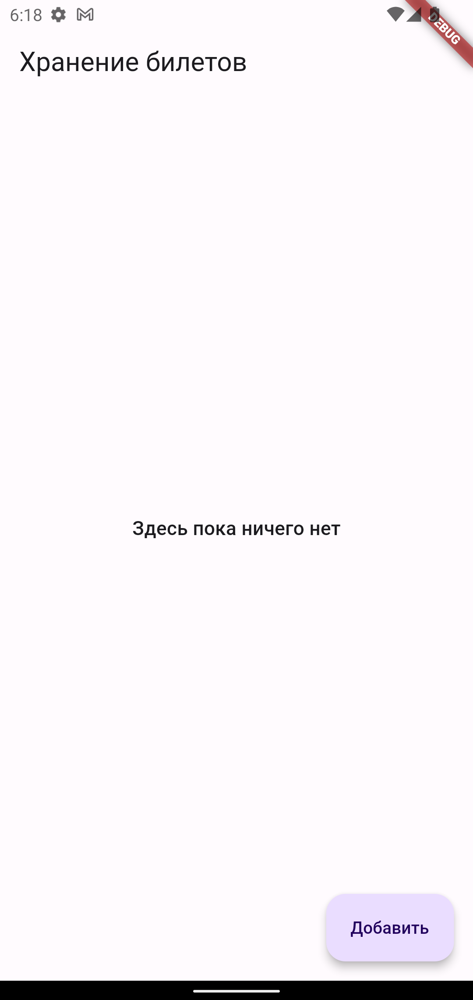

#### Состояние отсутствия данных
При отсутствии скачанных или доступных для скачивания файлов должен отображаться экран с надписью “Здесь пока ничего нет”.

#### Состояние загрузки данных
В процессе загрузки доступных для скачивания файлов должен отображаться прогресс загрузки.

#### Модалка “Добавление ссылки”
На модалке присутствует два компонента:

- Текстовое поле с предложением ввести URL
- Кнопка “Добавить”

  
  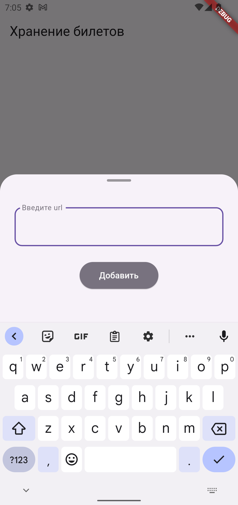

По нажатию кнопки “Добавить” валидируется поле с URL по параметрам соответствующим URL.

  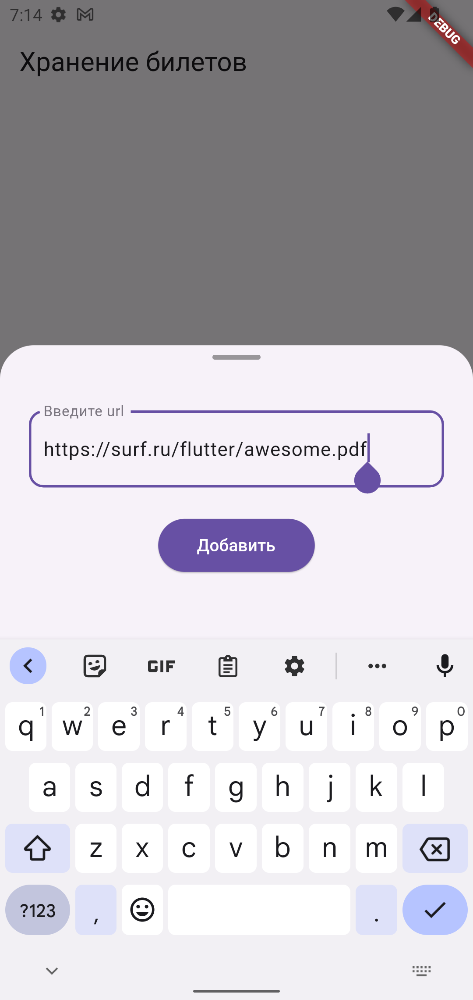
  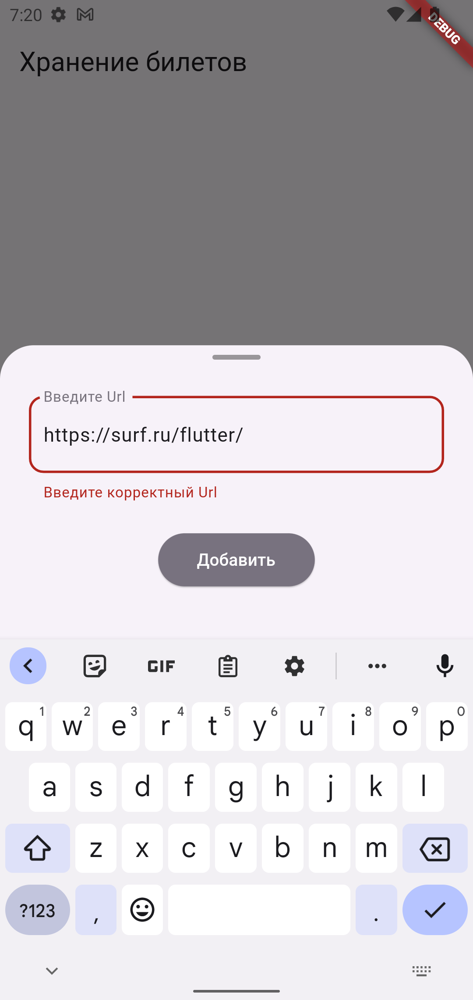

Если валидация проходит, на основной экран добавляется один элемент “Файл”.

Если в буфере обмена есть ссылка формата .pdf обеспечьте её автоматическую подстановку в поле ввода url.

  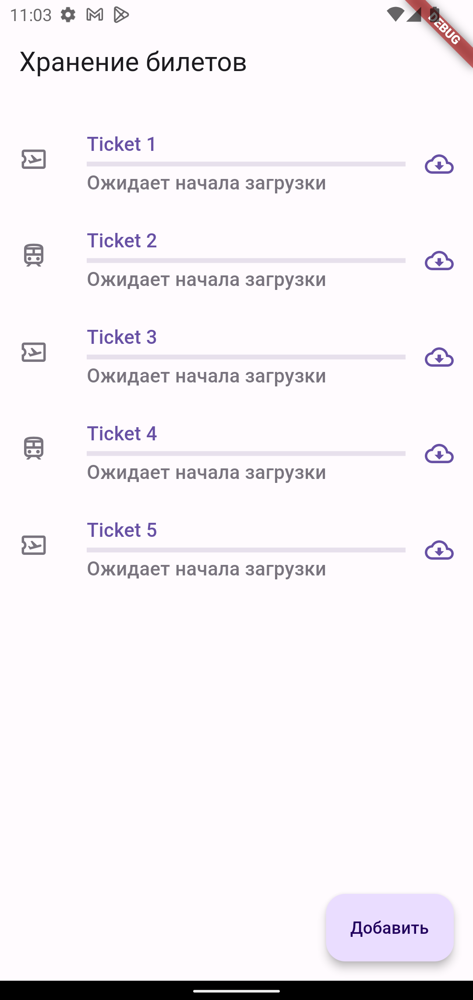
  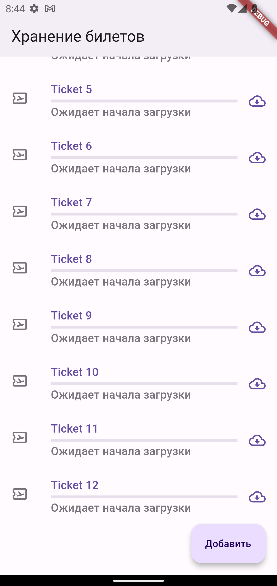

#### Компонент “Билет”
При успешном добавлении билет появляется в общем списке, но скачивание не начинается автоматически.

Элемент содержит следующие общие компоненты:
- Иконка билета
- Название файла, формируемое из конечного пути ссылки.
- Кнопка загрузки

В состоянии элемента, который доступен для скачивания:
- Кнопка загрузки находится в состоянии доступной для скачивания. По её нажатию начинается скачивание файла.

В состоянии, когда файл находится в процессе загрузки:
- Индикатор прогресса загрузки файла.
- Индикатор прогресса загрузки в Мбайтах: текущее значение и общий вес файла.
- Кнопка загрузки меняется на паузу. По её нажатию останавливается загрузка файла.

В состоянии, когда файл загружен и находится на устройстве:
- Кнопка загрузки становится неактивной.

  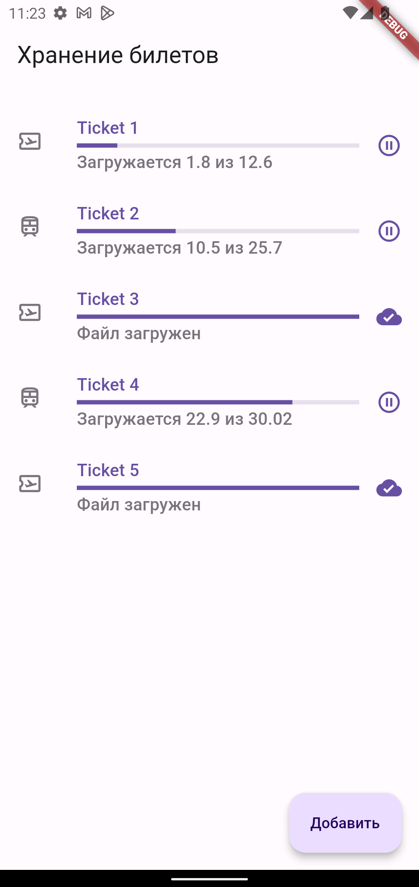
  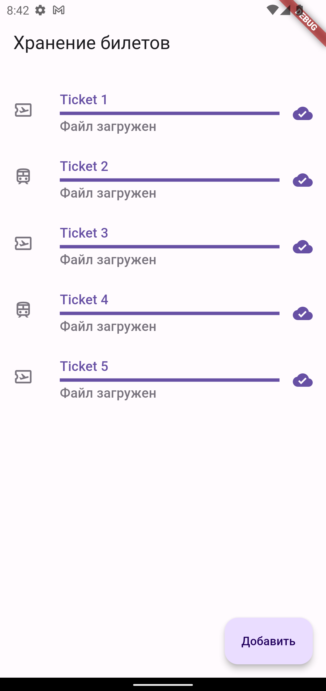

 
## Итак, давайте начнём!

> Небольшие рекомендации: 
> 
> - Не забывайте писать комментарии к классам и методам чтобы другим разработчикам было сразу понятно что тут происходит. 
> Умение писать понятный код это важный навык для командной разработки.
> - Помните про форматирование кода 👆.

### Задание 1

Реализуйте интерфейс экрана: Аппбар, состояния экрана, модальное окно (или боттомшит), кнопки, карточку файла.

### Задание 2

Реализуйте логику добавления ссылки на загрузку файла. Не забудьте про валидацию данных!

Реализуйте отображение снекбара при успешном добавлении ссылки.

🔥 При наличии ссылки формата .pdf в буфере обмена обеспечьте её автоматическую подстановку в поле ввода url.

🔥🔥 Сохранение списка файлов в локальном хранилище.

### Задание 3

Реализуйте логику отображения списка файлов.

🔥 Добавить скрытие кнопки добавления ссылки, если долистали список до конца.

🔥🔥 Сортировка файлов по дате добавления, по состоянию загрузки с сохранением в локальной базе данных.

### Задание 4

Реализуйте процесс загрузки и сохранения файлов. В качестве клиента можно использовать пакет **DIO**: [https://pub.dev/packages/dio](https://pub.dev/packages/dio)

🔥 Удаление файла из хранилища.

🔥🔥🔥 Загрузка всех незагруженных файлов по одной кнопке. 

Можно реализовать разные варианты:

- Загрузить все незагруженные.
- Добавить отображение чекбоксов для выбора файлов и загрузить все выбранные файлы.
- Скрывать кнопки, если долистали до конца списка.

  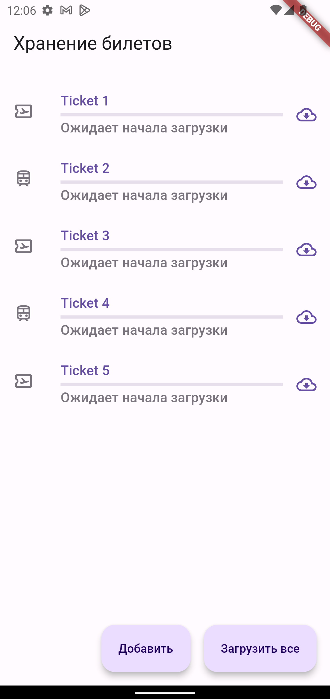
  

  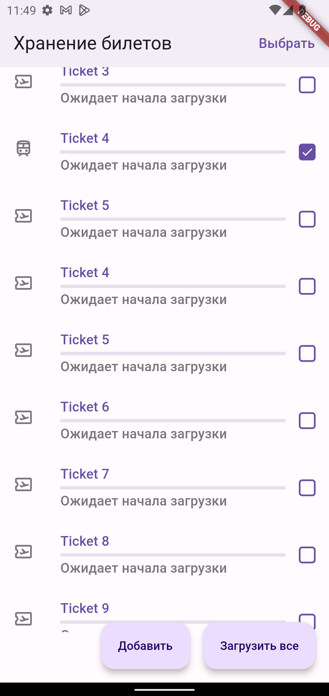
  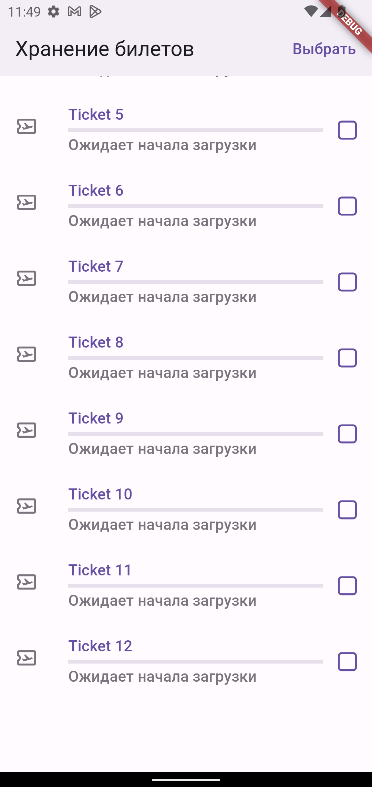

### Задание 5 🔥🔥

Откройте pdf файл для просмотра на отдельном экране

### Креатив 🔥🔥🔥

Успели сделать все задания раньше всех или просто хотите выделиться? Доработайте фичу по своему усмотрению!

# Предоставление результатов

Умение защитить результаты своей работы - невероятно важный навык для разработчика.

В текущем проекте есть файл `/docs/RESULT.md`. Этот шаблон нужен как раз для того, чтобы вы могли поделиться результатами вашей работы. Вы можете записать скринкаст, сделать скриншоты или целый README-файл, в котором будет описано, что вы успели сделать.

Это один из критериев, по которому будет оцениваться ваша работа!