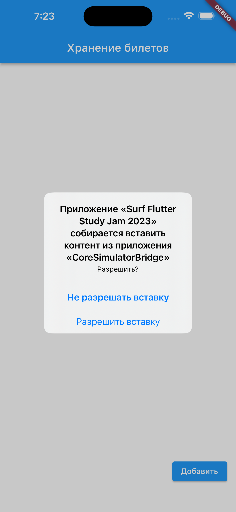
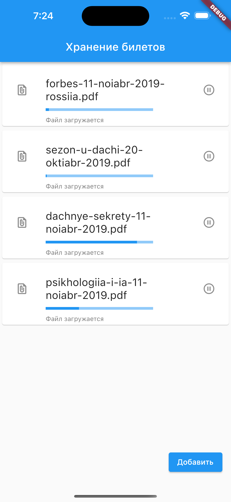

# Целевая платформа

Разработка и тестирование происходала на платформе IPhone 14 Pro Max

# Результаты

По возможности, прошу указать на ошибки

При реализации были использованы следующие стронние пакеты:
  - dio
  - path_provider
  - flutter_pdfview
  
## Чеклист
- [x] Вёрстка основного экрана списка документов
- [x] Вёрстка экрана добавления ссылки
- [x] Вёрстка экрана просмотра pdf документа
- [x] Логика добавления ссылки 
- [x] Валидация ссылки
- [x] 🔥 При наличии ссылки формата .pdf в буфере обмена обеспечьте её автоматическую подстановку в поле ввода url.
- [x] Сохранение файлов в локальном хранилище 
- [ ] Сохранение списка файлов в локальном хранилище 
- [x] Логика отображения списка файлов
- [x] Обновление статуса загрузки
- [ ] Функционал паузы загрузки
- [ ] Функционал удаление файлов
- [x] Функционал кнопки множественной загрузки (но есть баги)
- [x] Открытие pdf
- [ ] Написание тестов
- [ ] Более удачная реализация обновления стейта
- [ ] Более удачная реализация обновления стейта

# Ссылки на демонстрацию работы/скриншоты

Тестирование функционала производилось на файлах:
https://journal-free.ru/download/psikhologiia-i-ia-11-noiabr-2019.pdf
https://journal-free.ru/download/dachnye-sekrety-11-noiabr-2019.pdf
https://journal-free.ru/download/sezon-u-dachi-20-oktiabr-2019.pdf
https://journal-free.ru/download/forbes-11-noiabr-2019-rossiia.pdf

