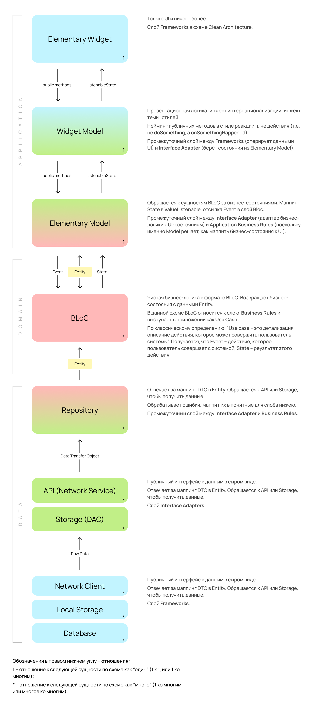

# Целевая платформа

Emulator (Pixel 4 API 33).
Simulator (Iphone 14 Pro Max)

# Результаты

> Этот проект создавался с целью воспроизвести архитектуру, применяемую в surf - сочетание Elementary + Bloc.

### Сделано

- Реализовано Задание 1. 👍
  - _Валидация ссылки через Uri.parse(url).isAbsolute._
  - _При вводе ссылки можно сделать выбор между самолётом и поездом._
- Приготовлено на **Elementary в связке с Bloc**. 🐄
- Заложена **локализация** на старте проекта. 🏳️
    - _Все строковые ресурсы могут быть переведены на другой язык добавлением .arb файла с переводами_
- **Код покрыт** исчерпывающей **документацией**. 📄
    - _Все публичные поля и классы задокументированы._
- Уделено **внимание безопасности** кода 🙏:
    - _При взаимодействии с nullable значениями `assert` по-дружески подскажет что не так,
      а приложение не упадет в проде с "красным экраном" т.к. после assert-функции по возможности стоит значение
      по-умолчанию._
    - _Для передачи данных вместо List использован Iterable. Так, пользовательский код не сможет случайно модифицировать
      список в WM и получить side-эффект в другом слое. Для изменения ему придется вызвать метод toList(), который
      создаст
      копию списка, а не просто сошлётся на него по ссылке._
- Соблюдены [**соглашения о коммитах**](https://www.conventionalcommits.org/ru/v1.0.0/). 🤝
- Добавлен голден-тест экрана. 🎰
    - _Лично мне голдены вселяют уверенность при последующум развитии проекта._

### Не сделано

- Задание 1. При выборе между самолётом и поездом чекбокс не перерисовывается.
- Задание 2, а именно добавление ссылки срабатывает в первый раз, но при повторном добавлении перерисовка не происходит.
  Причину не успел отследить. _(На видео скринкаста перерисовка происходит с помощью hotreload)_.
- Остальные задания даже не пытался, т.к. преследовал другие цели.

[//]: # (Громкий заголовок который должен привлечь внимание:)

### Я знаю как именно Марк любит готовить Bloc! 🐽

> На лекциях Марк упомянул статью [Как подружить Elementary и BLoC](https://habr.com/ru/companies/surfstudio/articles/667272/),
> заявив что имеет другое виденье на этот счёт

Работая в Surf я успел изучить реализацию Bloc + Elementary от Марка. Надеюсь моя интерпритация такой реализации придётся ему по душе.

[//]: # (И если всё ок, могу потом как-нибудь доделать и на основе этого можно будет новую статью выпустить 😊.)
[//]: # (Лично мне такая реализация тоже больше зашла 👍 )

В качестве вдохновения использована схема, украденная у него из проекта 👹:

# Ссылки на демонстрацию работы/скриншоты

Демонстрация работы загружена на [Yandex.disk](https://disk.yandex.ru/i/qfYpICYp8tJRlA)
и продублирована
[в ассетах этого репозитория](screencast%2Fsurf_flutter_jam_2023.mov).
